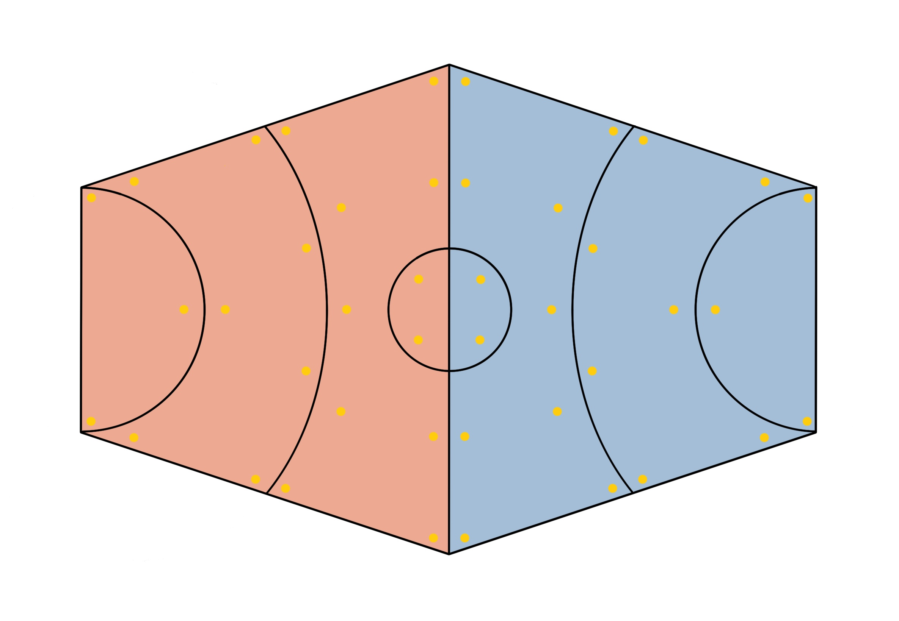

# Pro Bending

The rules of pro bending are pretty simple. Take control over the area in a specified amount of time until you either defeat your opponents or win. 

> #### Bending X Leagues
> Leagues with more lax rules exist. In these far more dangerous matches, any manifestation of the elements is allowed, including ice, lightning, magma, plants, and more.

## Rules
*The rules are based off of the rules listed [here](https://avatar.fandom.com/wiki/Pro-bending).*

The ring is divided into two halves, each of which is further divided into three sections, and a central circle to be used in tie-breakers. Each section is 30 feet wide. Teams begin the match facing each other in the two sections closest to the center. The goal is to knock the other team back and off the platform.

The ring is usually either built on top of water or surrounded by a trench of water, which provides enough material for waterbenders. Additionally, it is dotted with earthen disks (in yellow) for the earthbenders.

Each "round" of the game consists of 4 rounds of combat and there are 12 rounds total (3 sets of 4).
- When the time expires, whichever team has advanced into the opposite side of the ring wins the round.
- If a round is tied, the tie is resolved by a 1-on-1 match-up. A coin toss is performed, and the team that wins the coin toss chooses an element for the 1-on-1, which takes place entirely in the central circle of the ring. In this match-up, players can switch sides and grapple each other, and whoever knocks the other team out of the circle first wins the tie-breaker.
- If all players on a team are KO'd (knocked completely off the back of the platform), the other team wins the entire match.

### Actions
- **Attack:**
    - On a hit, the target takes damage and is knocked back a number of feet equal to the damage.
    - Additionally, when you are reduced to 2/3 of your total HP you are moved back one section, and again when you are reduced to 1/3. (So, when you are at 2/3 health, you move to the 2nd section from the center, and at 1/3 to the last section.)
    - When everyone on one team is knocked out of a section, each player on the other team advances one zone.
    - If a player is knocked to 0 HP, they are knocked back 3 sections (knocking them off the map unless ground was taken).
    - Regaining an area does not restore the corresponding HP.
    - Normal dnd actions that will be at the DM's discretion (?)
- **Move:**
    - You can use your movement to reposition yourself within your zone.
    - If you step over the back of your zone, you forfeit the ground and must move back to that zone. This doesn't apply to the last zone, and you must be knocked off the back edge to be knocked out of the last zone.
    - You cannot move up a zone unless your entire team moves up, which cannot happen without knocking all opposing team members out of the next zone first. 
- **Healing:**
    - Healing is permitted, but it won't move you up a zone. That is, if you drop below 1/3 HP and then heal back up to over 2/3, you can't go back into the first zone.

> #### Fouls
> If you commit a foul, you move back one zone. Examples of fouls in pro-bending include:
> - Hosing (bending a water stream at an opponent for an excessively long time)
> - Bending an earth disk outside your zone
> - Creating ice
> - Headshots
> - Mixing water and rocks
> - Grappling

### Crowd Mechanic
- Each round, one player on each time can flavor an attack to try to gain the crowd's favor. The players roll contesting Charisma (Performance) check.

- The crowd can be in a neutral state, a negative state, or a positive state, depending on your team's amount of "crowd points". A team can have at most +3 and at minimum -3 crowd points. (If you have +3 points and gain a point, you stay at +3, and vice versa: if you are at -3 and lose a point, you stay at -3.)
    - The team with the winner of the contested Performance check gains a crowd point, and the other team loses a point.
    - Because one team's loss is the other team's gain, the two teams' crowd points always sum to 0.

> For example, the firebender Jian-Yang uses the *Projectiles* form three quick attacks at an opponent. He wants to make it look very impressive, so he decides to launch them in midair as he performs a forward flip, launching the first two from each of his feet as he flips and the last one with his right fist as he lands.   
> 
> To complete this feat, he rolls a Performance check contested by a player on the opposite team. On a success, the crowd is impressed and his team gains a crowd point. On a failure, the performance is lackluster (maybe he stumbles on the landing) and the crowd is disappointed. His team loses a crowd point.

- Having the crowd on your side gives your team one inspiration point for the round, to give to one player on the team as you see fit.
- At the end, the team who has the crowd the most will split the vote in case of a tie (?)
- **Teamwork:**
    - If your team lands three attacks in one round, you gain advantage on your roll to impress the crowd.